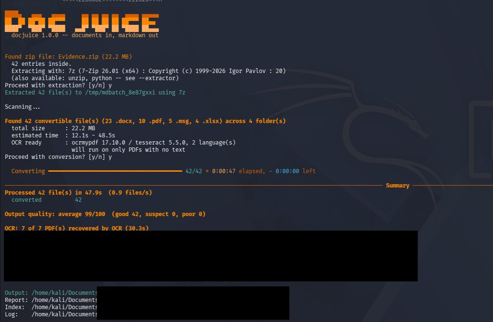
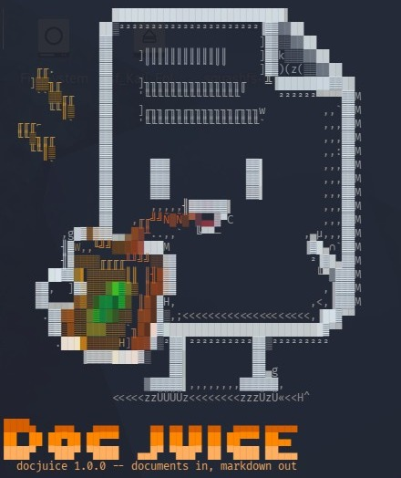

<p align="center">
  
</p>

<h1 align="center">docjuice</h1>

<p align="center"><b>Documents in, Markdown out.</b></p>

<p align="center">
  Batch-convert folders and zip archives of documents to Markdown with
  <a href="https://github.com/microsoft/markitdown">Microsoft MarkItDown</a>,
  keeping the folder structure, recovering scanned PDFs with local OCR,
  and scoring every output's quality.
</p>

---

## What it looks like

Point it at a zip archive, a folder, or a single file:

```bash
docjuice ~/Documents/Collection.zip
```

It shows what it found and asks before doing anything, then converts every document with a live progress bar and finishes with a summary of what worked, what didn't, and why:

<p align="center">
  
</p>

And this is what greets you in the terminal:

<p align="center">
  
</p>

## What it does

It finds every convertible document — recursing through nested folders — converts each one with MarkItDown, cleans up the resulting Markdown, scores its quality, and writes everything into a new folder that mirrors the original tree exactly:

```
contracts/                     contracts_markdown/
├── 2025/                      ├── 2025/
│   ├── q1/                    │   ├── q1/
│   │   └── msa.docx           │   │   └── msa.md
│   └── q2/              -->   │   └── q2/
│       └── sow.pdf            │       └── sow.md
└── data/                      ├── data/
    └── rates.xlsx             │   └── rates.md
                               ├── index.md
                               └── _conversion_report.md
```

---

## Install

```bash
cd /path/to/docjuice
chmod +x install.sh
./install.sh
```

That's it. The installer builds a private virtual environment, installs the dependencies into it, and puts a `docjuice` command on your PATH. From then on you just run it — from any directory, with nothing to activate:

```bash
docjuice ~/Documents/contracts
docjuice ~/Downloads/archive.zip
docjuice --doctor
```

**There is nothing to activate and nothing to close.** Activating a virtual environment only edits your shell's `PATH`; the launcher calls the environment's Python directly, which achieves the same thing. The process starts, converts, prints the summary and exits.

If the installer says `~/.local/bin is NOT on your PATH`, add it:

```bash
echo 'export PATH="$HOME/.local/bin:$PATH"' >> ~/.zshrc   # or ~/.bashrc
source ~/.zshrc
```

The installer also reports which optional system tools are missing and gives you the one `apt` command to install them:

```bash
sudo apt install ocrmypdf tesseract-ocr p7zip-full wamerican
```

None are required, but `ocrmypdf` + `tesseract-ocr` matter if you have scanned PDFs — without them those convert to empty files.

### How the launcher behaves

It repairs itself. If the virtual environment is missing or broken it rebuilds it on the next run. If you edit `requirements.txt` it notices (by hash) and re-syncs, then stays quiet on later runs. The overhead of that check is a few milliseconds; set `DOCJUICE_SKIP_CHECK=1` to skip it entirely.

Exit codes, Ctrl+C and terminal colours all pass straight through, so it behaves like any other command in scripts and pipelines.

Locations, all overridable by environment variable:

| What | Where | Override |
| --- | --- | --- |
| launcher | `~/.local/bin/docjuice` | `DOCJUICE_BIN` |
| virtual environment | `~/.local/share/docjuice/venv` | `DOCJUICE_VENV` |
| source files | wherever you put them | re-run `install.sh` after moving |

Uninstall with `./install.sh --uninstall` — it removes the launcher and the environment, and leaves your source files alone.

### Manual install

If you'd rather not use the installer:

```bash
sudo apt install python3-venv python3-pip -y
python3 -m venv ~/docjuice-env
source ~/docjuice-env/bin/activate
cd ~/docjuice
pip install -r requirements.txt
docjuice --doctor
```

With a manual install you'll need to run the `source` line in each new terminal, and invoke the tool as `python3 docjuice ...` from its folder.

### Checking your setup

```bash
docjuice --doctor
```

```
-- Environment check -----------------------------------------------------------
Python        : 3.11.15  (/home/you/.local/share/docjuice/venv/bin/python)
Environment   : virtual environment (/home/you/.local/share/docjuice/venv)

markitdown    : 0.1.8
rich          : installed (progress bar and colour)
ftfy          : installed (mojibake repair)

Format support:
  .docx   yes   (mammoth)
  .pdf    yes   (pdfminer)
  .pptx   yes   (pptx)
  .xlsx   yes   (openpyxl)
  ...

Unzip tools:
  -> 7z       7z (7-Zip 26.01)
     unzip    unzip (UnZip 6.00 of 20 April 2009, by Debian. Original by Info-ZIP)
     python   python zipfile (stdlib 3.11)

OCR (scanned PDFs): ocrmypdf 17.12.1 / tesseract 5.3.4, 4 language(s)

Everything needed is installed.
```

Anything missing, `--doctor` offers to install for you. `docjuice --version` gives the same version information more briefly.

### If a dependency goes missing later

Everything here is built on top of [MarkItDown](https://github.com/microsoft/markitdown) — without it there is nothing to run. So docjuice checks for it at startup and, if it is missing, offers to install it rather than just telling you the command:

```
markitdown is not installed -- it is the engine this tool runs on.
  Target interpreter: /home/you/.local/share/docjuice/venv/bin/python
  Environment       : virtual environment (/home/you/.local/share/docjuice/venv)
Install markitdown[all] now? [y/n]
```

It installs into **the interpreter that is actually running the script**, which is usually the fix for "but I did install it" — the package went into a different Python than the one you are running.

Inside a virtual environment it installs directly. On a bare Kali system Python it will *not*: Debian-based distros mark their system Python as externally managed (PEP 668) specifically to stop pip from conflicting with apt, so docjuice respects that and shows you the venv commands instead:

```
FATAL: markitdown is not installed, and this is an externally managed
  system Python (Kali/Debian/Ubuntu protect it from pip).

  Recommended (a virtual environment keeps this off your system Python):
      python3 -m venv ~/docjuice-env   # or just run ./install.sh
      source ~/docjuice-env/bin/activate
      pip install 'markitdown[all]' rich ftfy

  Or, to install onto the system Python anyway (not recommended --
  it can conflict with apt-managed packages):
      re-run with --allow-system-install
```

The same applies to format support. If the pre-flight scan finds `.xlsx` files but the Excel extra is not installed, it offers to install it right there rather than letting every spreadsheet fail and making you start over.

Use `--no-install` to turn all of this off and have it only report what is missing — useful for scheduled runs where you do not want surprise package installs.

---

## Usage

```bash
# a zip archive (asks before extracting)
docjuice reports.zip

# a folder, custom output location, live per-file progress
docjuice ~/Documents/contracts -o ~/docjuice-out --verbose

# see what it would do without writing anything
docjuice ~/Documents --dry-run

# unattended (answers yes to every prompt)
docjuice reports.zip --yes

# re-run only the files that failed last time
docjuice --retry-failed docjuice-out/_failed_manifest.json
```

By default output goes to `<input>_markdown` next to the input.

### Supported formats

PDF, Word (`.docx`), PowerPoint (`.pptx`), Excel (`.xlsx`, `.xls`), EPUB, Outlook (`.msg`), HTML, CSV, TSV, JSON, XML, plain text, RTF, images (`.png .jpg .gif .bmp .tiff .webp` — EXIF plus OCR), and audio (`.wav .mp3 .m4a` — EXIF plus transcription).

Each format needs its MarkItDown extra installed. If files of a type are found but its extra is missing, docjuice warns during the pre-flight scan and tells you the exact `pip install` to run.

---

## What happens on a run

**1. Pre-flight scan.** Before anything is written, docjuice walks the tree and reports what it found:

```
Found 47 convertible file(s) (23 .docx, 12 .pdf, 8 .pptx, 4 .xlsx) across 12 folder(s)
  total size      : 240.1 MB
  estimated time  : 1m 12s - 4m 48s
  unsupported     : 6 file(s) will be ignored
  unreadable      : 3 file(s) (permission denied)
  unlistable dirs : 1 -- their contents are NOT included
Proceed with conversion? [y/n]
```

For a zip it first asks before extracting, and tells you which unzip tool it will use. You find out about permission problems and missing dependencies *here*, not four minutes later.

**2. Validation.** Each file is checked before conversion — magic bytes against the extension (catching a PDF that is really an HTML error page), zero-byte and truncated files, archive integrity for Office formats, and password protection. These fail clearly instead of producing plausible-looking garbage.

**3. Conversion.** Files are converted with a per-file timeout so one malformed document cannot stall the run. Files whose `.md` already exists and is newer are skipped (`--force` overrides).

**4. Cleanup.** The Markdown is repaired and tidied: mojibake fixed via `ftfy`, repeated headers/footers and page numbers removed, hyphenated line breaks rejoined, `(cid:NNN)` artifacts and control characters stripped, whitespace normalised. Every removal is logged with a count, so nothing disappears silently. Use `--no-clean` to skip it, `--keep-raw` to write the uncleaned version alongside as `.raw.md`.

**5. Quality scoring.** Each output gets a 0–100 score and a `good` / `suspect` / `poor` grade from seven heuristics: extraction yield versus file size, encoding artifacts, character mix, dictionary hit rate, word-length distribution, line repetition, and whitespace ratio. Problem files come with a diagnosis and a suggested fix:

```
broken/scan.pdf  [12/100 poor]
    near-zero text extracted from a PDF -- almost certainly a scanned document
    with no text layer
    fix: pip install markitdown-ocr  (or pre-process: ocrmypdf in.pdf out.pdf)
```

These heuristics catch *mechanically* broken output reliably. They cannot tell you whether a cleanly-extracted document is semantically complete — treat `poor` as "look at this one", not as proof of corruption.

**6. Reporting.** A summary prints to the terminal and is also saved as `_conversion_report.md` inside the output folder, so it survives your terminal scrollback. Failures are grouped by cause with an actionable fix:

```
12 file(s) -- failed: No module named 'openpyxl'
    fix: missing dependency -- pip install 'markitdown[xlsx]'
```

---

## Output folder contents

| File | What it is |
| --- | --- |
| `<mirrored tree>/*.md` | the converted documents, each with YAML frontmatter recording source path, conversion time, and quality score |
| `index.md` | a navigable list of every converted document, grouped by folder, with quality grades |
| `_conversion_report.md` | the full summary: totals, timings, quality table, converted list, problems, cleanup actions |
| `_failed_manifest.json` | failed files only — feed it to `--retry-failed` |
| `_run_<timestamp>.log` | complete log with full Python tracebacks for every failure |

---

## OCR for scanned PDFs

A scanned PDF is a picture of a page with no text layer, so MarkItDown extracts nothing from it and you get an empty `.md`. docjuice detects this from the quality score and fixes it automatically.

Install the OCR tools once:

```bash
sudo apt install ocrmypdf tesseract-ocr -y
```

That's it — no configuration. On the next run, any PDF that yields almost no text is OCR'd and converted again:

```
OCR: 7 of 7 PDF(s) recovered by OCR (42.1s)
  scans/signed_letter.pdf                           10 -> 91/100
  scans/2024/site_certificate.pdf                   10 -> 88/100
```

**Everything runs locally.** ocrmypdf drives tesseract on your own machine — no API key, no per-page cost, and your documents never leave the computer. That last point matters for confidential or legal material; the alternative `markitdown-ocr` plugin uploads page images to OpenAI, which docjuice deliberately does not use.

**It only OCRs what needs it.** OCR is slow — seconds to minutes per file — so `auto` mode (the default) spends it only on PDFs whose quality score shows extraction genuinely failed. A PDF that already converted well is never re-processed. In a mixed folder you will see exactly this:

```
  [1/2] normal_text.pdf
      OK 17ms [99/100 good]
  [2/2] scanned_certificate.pdf
      OCR scanned_certificate.pdf...
      OK 1.6s [95/100 good]
```

**A failed OCR pass never makes things worse.** The OCR'd result is scored independently and kept only if it beats the original. If it doesn't, the original is kept and the report says so.

Every OCR'd file records its provenance in the frontmatter, which matters when the output is evidence:

```yaml
quality_score: 95
quality_grade: good
ocr: true
ocr_engine: "ocrmypdf 17.12.1 / tesseract 5.3.4"
ocr_language: "eng"
quality_score_before_ocr: 10
```

### OCR options

| Flag | Effect |
| --- | --- |
| `--ocr auto` | default — OCR only PDFs that yielded almost no text |
| `--ocr always` | attempt OCR on every PDF (slow; keeps whichever result scores better) |
| `--ocr never` | disable OCR entirely |
| `--ocr-lang eng+hin` | tesseract languages; install extras with `apt install tesseract-ocr-hin` |
| `--ocr-force` | re-OCR every page rather than only pages lacking text — try this if a normal pass didn't help |
| `--ocr-timeout 600` | per-file OCR limit in seconds |
| `--keep-ocr` | also save the searchable PDF as `<name>.ocr.pdf` — useful output in its own right |

If ocrmypdf isn't installed, the pre-flight scan warns you before any work starts and tells you the command to fix it; scanned PDFs are then simply reported as `poor` rather than silently converting to nothing.

One caveat: OCR'd text sometimes comes out formatted as a markdown table, because tesseract reports word positions and the PDF reader interprets wide spacing as columns. The text is complete, just oddly laid out. Multi-column and heavily formatted scans are most prone to this.

---

## Unzip tools

Before extracting an archive, docjuice looks for an unzip tool already installed on your system and uses it in preference to Python's built-in zip reader:

```
Found zip file: reports.zip (130.3 KB)
  16 entries inside.
  Extracting with: unzip (UnZip 6.00 of 20 April 2009, by Debian. Original by Info-ZIP)
  (also available: python -- see --extractor)
Proceed with extraction? [y/n]
```

It prefers `7z`, then `unzip`, then `bsdtar`, and falls back to Python's `zipfile` when none is installed. The reason for preferring a system tool is practical: Python's reader cannot open Deflate64 archives — which Windows produces when compressing large folders — and trips over a few other vendor variants. `7z` and `unzip` handle them.

If the system tool fails for any reason, docjuice says so and automatically retries with Python's reader rather than giving up:

```
  unzip could not extract this archive (exit 9); falling back to Python's reader.
```

`--version` shows which tools were found and which one `auto` will pick. Override it with `--extractor 7z|unzip|bsdtar|python`; asking for a tool that isn't installed gives a clear error listing what *is* available.

Whichever tool is used, the extracted files are checked afterwards for symlinks pointing outside the extraction folder — a trick a hostile archive can use to redirect later writes onto files elsewhere on your system. Any that are found are deleted and logged:

```
  removed 1 unsafe symlink(s) from the extracted files
```

This check matters specifically for the system tools: they recreate symlinks from the archive, whereas Python's reader does not.

---

## Permissions

Unreadable files are reported separately from conversion failures, with the owner and mode so the fix is obvious:

```
1 file(s) -- permission-denied: permission denied (owner root:root, mode 600)
    sub/secret.csv
    fix: sudo chown $USER '/path/to/sub/secret.csv'  --or re-run with --sudo
```

Directories that cannot be listed are reported too. This matters more than it sounds: Python's `os.walk` silently skips unreadable directories by default, so without explicit handling an entire subtree of documents would vanish and the summary would still claim complete success.

### Elevated access

If files are unreadable, docjuice offers to retrieve them with `sudo`:

```
8 file(s) could not be read (permission denied):
    archive/legal/sealed.docx  (owner root:root, mode 600)
    ...
Attempt to access them with elevated privileges? (sudo will prompt for your password directly) [y/n]
```

**The script never sees your password.** It shells out to `sudo`, and sudo prompts on the terminal itself — nothing is captured into a Python variable where it could leak into a traceback or the log file.

Only a narrow copy runs elevated: the named files are copied to a temporary staging area and chowned to you, then conversion runs unprivileged. MarkItDown parses PDFs, Office XML and zip containers through a stack of third-party libraries, and that is not code you want running as root.

Use `--sudo` to skip the question, `--no-sudo` to disable it entirely. If sudo is unavailable, you are not a sudoer, or there is no terminal to prompt on, those files are simply reported as denied and the run continues.

Running the whole script with `sudo` works but leaves every output file owned by root — docjuice warns you if you do.

---

## Troubleshooting

| Symptom | What to do |
| --- | --- |
| Anything dependency-related | `--doctor` shows exactly what is and isn't installed, and offers to fix it |
| "markitdown not installed" but you installed it | `--doctor` prints the interpreter path — the package almost certainly went into a different Python |
| Something looks wrong | Check `_run_<timestamp>.log` in the output folder — it has full tracebacks for every failure |
| Not sure it sees your files | `--dry-run` shows exactly what it found and where each output would go, writing nothing |
| Want to watch it work | `--verbose` prints a line per file with timing and quality score |
| Appears frozen | `--verbose` shows which file it is on; `--timeout N` caps per-file time |
| Suspect a stale install | `--version` prints script, markitdown, Python versions and detected unzip tools (also logged at the top of every run) |
| A zip won't extract | `--extractor` forces a specific tool; install `p7zip-full` for the widest format support |
| A PDF converted to nothing | It's a scan. `sudo apt install ocrmypdf tesseract-ocr` and re-run with `--force` |
| OCR ran but didn't help | Try `--ocr-force`; if that fails too, the scan is too poor to read |
| Fixed a dependency, don't want a full re-run | `--retry-failed <manifest>` processes only the previously failed files |
| Output looks over-cleaned | `--keep-raw` writes the uncleaned `.raw.md` beside each file so you can compare |

### Exit codes

`0` everything converted · `1` some files failed, or interrupted · `2` fatal error (bad input path, markitdown missing, output not writable)

---

## All options

```
positional:
  input                  zip file, folder, or single file

output:
  -o, --output PATH      output folder (default: <input>_markdown)

behaviour:
  -y, --yes              answer yes to all prompts (including installs)
  --dry-run              show what would happen; write nothing
  --doctor               check the environment, offer to install what is
                         missing, and exit
  --no-install           never offer to install anything; only report
  --allow-system-install permit pip into an externally managed system Python
                         (adds --break-system-packages; a venv is safer)
  --force                re-convert even if output is newer than source
  --timeout SECONDS      per-file timeout (0 disables; default: 120)
  --keep-extracted       keep the temporary zip extraction folder
  --recursive-zip        also extract zips found inside the tree
  --extractor TOOL       auto | 7z | unzip | bsdtar | python
                         (auto prefers an installed system tool)
  --plugins              enable markitdown 3rd-party plugins

cleanup:
  --no-clean             skip the markdown cleanup pass
  --keep-raw             also write the uncleaned output as <name>.raw.md

OCR (scanned PDFs, runs locally via ocrmypdf):
  --ocr MODE             auto (default) | always | never
  --ocr-lang LANG        tesseract language(s), e.g. eng or eng+hin
  --ocr-force            re-OCR every page instead of only pages without text
  --ocr-timeout SECONDS  per-file OCR limit (default: 600)
  --keep-ocr             also save the searchable PDF as <name>.ocr.pdf

permissions:
  --sudo                 elevate for unreadable files without asking
  --no-sudo              never attempt privilege escalation

output/debug:
  -v, --verbose          per-file progress lines instead of the bar
  --no-color             disable coloured output
  --banner STYLE         full | compact | none  (or set DOCJUICE_BANNER)
  --no-banner            same as --banner none
  --log PATH             log file path (default: <output>/_run_<timestamp>.log)
  --retry-failed FILE    re-run only files from a previous _failed_manifest.json
  --version              print versions and exit
```

---

## Project layout (reference)

```
install.sh       one-time setup: venv, dependencies, launcher
docjuice         CLI, scanning, orchestration, reporting
logo.py          the colour logo (optional -- the tool runs without it)
validate.py      input validation + output quality scoring
clean.py         markdown cleanup rules
requirements.txt Python dependencies
assets/          images used by this README
```

All of these must sit in the same folder.

## Notes and limits

- Per-file timeouts use `SIGALRM`, which is Unix-only and cannot interrupt a hang inside a C extension. It covers Python-level hangs, which is the common case.
- Conversion is single-threaded. Parallel workers were deliberately left out: they interleave output and make failures much harder to diagnose. For very large batches this is the obvious next addition.
- Quality heuristics are tuned for English prose. Documents in other languages generally land in `suspect` rather than `good` — flagged for a look, not treated as broken.
